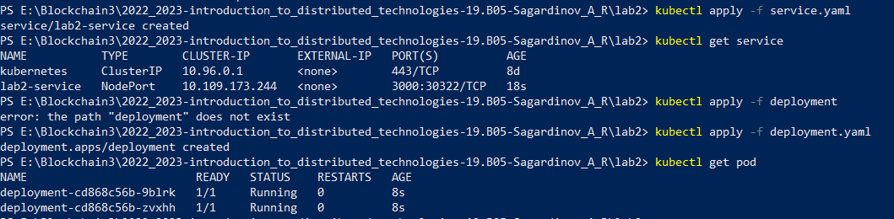

University: [SPBU](https://spbu.ru/)  
Faculty: [MM](https://math.spbu.ru/rus/)  
Course: [Introduction to distributed technologies](https://github.com/itmo-ict-faculty/introduction-to-distributed-technologies)  
Year: 2022/2023  
Group: 19.Б05  
Author: Sagatdinov Artur Rinatovich  
Lab: Lab2  
Date of create: 15.12.2022  
Date of finished: 20.12.2022  

## Ответы на вопросы  
  
### 1) Что сейчас произошло и что сделали команды указанные ранее? 
- Сначала запустили minikube, с помощью команды `minikube start`.
- Создаем сервис с помощью команды `kubectl apply -f service.yaml`
- Создаем кластеры с помощью команды `kubectl apply -f deployment.yaml`
- Проверяем выполнение:  

- Подключаемся к сервису с помощью команды `minikube service lab2-service`